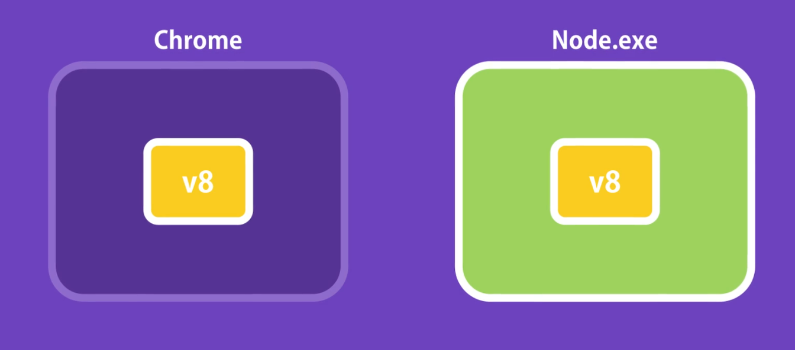
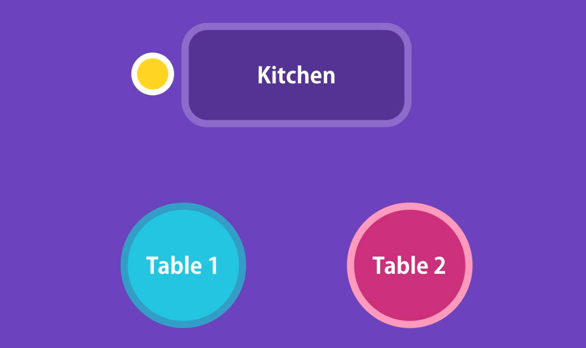
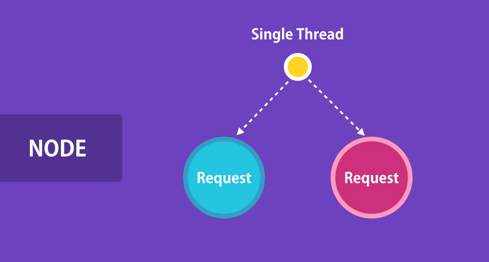
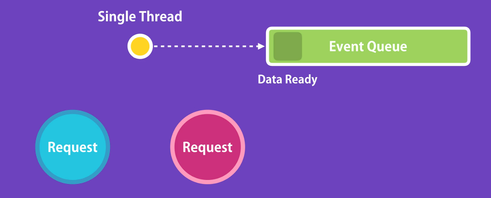

# What is Node ?

**Node.js** is an **open-source, cross-platform runtime environment** that allows you to **run JavaScript code outside of the browser**. It is commonly used to build **backend services**, also known as **APIs (Application Programming Interfaces)**, which power client-side applications such as web or mobile apps.

Node.js is especially suitable for building **highly scalable, data-intensive, and real-time backend services**.

### What Makes Node.js Special ?

1. Great for Prototyping and Agile Development

2. Superfast and Highly Scalable ( EX - PayPal rebuilt one of their apps using Node.js instead of Java, and it took half the time, used fewer developers, and ran much better—with _33% less code, 40% fewer files, twice the number of requests per second, and a 35% faster response time_.)

3. JavaScript Everywhere

4. Cleaner and More Consistent Codebase

5. Large Ecosystem of Open-Source Libraries

# Node Architecture

So, Node is a runtime environment for executing JavaScript code.

### But what is runtim envirionment really

Before Node, we used JavaScript only to build applications that run in our browsers.

So, every browser out there has a JavaScript engine that takes JavaScript code and converts it into code that the computer can understand.

For example, Microsoft Edge uses Chakra, Firefox uses SpiderMonkey, and Chrome uses V8. And because of this variety of engines, sometimes JavaScript code can behave differently in one browser compared to another. A browser provides a runtime environment for JavaScript code.

For example, in the browser we have the `window` or `document` object (`document.getElementById(' ')`). These objects allow us to work with the environment in which our code is running.

Up to 2009, the only way to execute our JavaScript code was inside a browser. In 2009, Ryan Dahl took Google’s V8 engine (which is the fastest JavaScript engine out there) and embedded it inside a C++ program, and called that program Node.

So, similar to a browser, Node is a runtime environment for JavaScript code. It contains a JavaScript engine that can execute our JavaScript code. But it also has certain objects that provide an environment for our JavaScript code. Butb*these objects are different from the environment objects* in our browser.

For example, we don’t have the `document object`. Instead, we have other objects that give us more interesting capabilities. For example, we can work with the file system (`fs.readFile()`), listen for requests on a given port (`http.createServer()`), and so on. We can’t do stuff like that inside a browser.

So in essence, **Node is a program that includes the V8 JavaScript engine plus some additional modules** that give us capabilities not available inside a browser. We can work with the file system, network, and so on. Both Chrome and Node use the same JavaScript engine, but they provide different runtime environments for JavaScript.

---

Some people compare Node with C# or Ruby or some other programming languages, but this is wrong because **Node is not a programming language**.

Some people compare Node with ASP.NET or Spring Boot. This is also wrong. These are **frameworks** for building web applications. **Node is not a framework**, it is a **runtime environment for executing JavaScript** code.

# How Node Works

Node applications are highly scalable because of the non-blocking / asynchronous nature of Node.

Asynchronous Example – There are two tables in a restaurant. A waiter comes and gives your order to the kitchen. **Then they move to the second table while the chef is preparing the meal**. So the same person can serve many different tables.

They don’t wait for the chef to cook one meal before they serve another table. **This is what we call the non-blocking asynchronous architecture**. This is how Node applications work.

A thread is like a waiter allocated to handle a request. So a single thread is used to handle multiple requests.

In contrast to the non-blocking / asynchronous architecture, we have **blocking / synchronous architecture**. In this architecture, the example is as follows:

Imagine we go to another restaurant. In this restaurant, the waiter is allocated for table 1. He takes the order and gives it to the kitchen. Now **they are sitting in the kitchen waiting for the chef to prepare the meal. And during this time, they are not doing anything else**. They are not going to take another order from another table until your meal is ready.

**This is what we call blocking / synchronous architecture.** That is how applications built with frameworks like ASP.NET and Rails work out of the box.

So when we receive a request on the server, a **thread is allocated to handle that request**. As part of handling the request, it is likely they are going to query a database, and sometimes it may take a little while until the result is ready. While the database is executing the query, that t**hread is sitting there waiting**. It can’t be used for another client.

**So we need a new thread for another client.**

At some point, we will run out of threads, so the new client has to wait until a thread is available. Or if we don’t want that, we should add more hardware (more servers). With this type of architecture, **we are not utilizing the resources efficiently**. This is the **blocking and synchronous architecture**. That’s how applications built with frameworks like _ASP.NET and Ruby_ work by default. In fact, in ASP.NET Core, we can build the asynchronous architecture, but we _have to do extra work for that_.

In contrast, **Node applications are asynchronous by default**. So we don’t need to do anything extra. In Node, we have a **single thread to handle all requests**. When a request arrives, that single thread is used to handle that request. If we need to query a database, **our thread doesn’t need to wait until the database returns the data**. While the database is executing our query, **that thread will be used to serve another client**.

When the database prepares the result, **it puts a message in the event queue**. Node is continuously monitoring this queue in the background. When it finds an event in this queue, it will take it out and process it.

---

So this type of architecture (**Node-type asynchronous architecture**) is ideal for building **I/O intensive apps** (applications that involve lots of disk or network access). We can serve more clients(requests) without needing to throw in more hardware. That is why **Node applications are highly scalable**.

In contrast, **Node shouldn’t be used for CPU-intensive** applications like video encoding or image manipulation services. In this kind of application, we have a lot of calculations done by the CPU, and only a few operations that touch the file system or network.

Since Node applications are **single-threaded**, when performing the calculation to serve one client, other clients have to wait. That is why **Node shouldn’t be used for CPU-intensive applications**. It should only be used for **data-intensive and real-time applications**.

---

**Run the program** using Node.js - _node app.js_ (node APPNAME.js)

If we add `console.log(window)` to the app file and run the Node file, then we will get an error, because we don't have a window object in Node. Instead, if we run this on the browser, we will get the window object.
