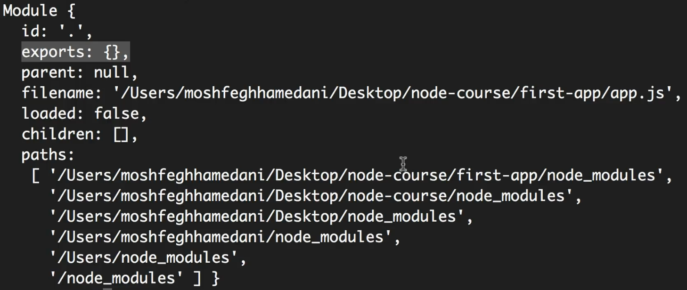

In this section, we explore a few modules that are built into the core of Node.js, such as `os` (Operating System), `fs` (File System), `events`, and `http`.

# Global Object

We can use `console.log` function to log something on console. This `console` is a global object, which means we can access it in any file.

We have other functions that are globally available in Node such as `setTimeout`, `clearTimeout`, `setInterval`, and `clearInterval`. There are some global objects that we learn later (os, path, etc...).

In **browser**, we have this **`window object`** that represents the global scope. So all the variables and functions we define globally can be accessed via this `window` object. (So we can call `window.console.log()` or simply `console.log()`. JavaScript engine will prefix this with `window.` because that is where this function is defined. All the above functions mentioned can be defined the same way – `window.setTimeout()` or directly.)

Also, if we define a variable like `var message = ""`, that will also be available(added) in the window object.

(Extra - With the introduction of ES6, _let_ and _const_ were added — and unlike var, they do not get added to the global object (like window in the browser), even if declared in the global scope. However, variables declared with **var** do get added to the global object, but only if they are declared in the global scope. If var is declared inside a function, it will not be added to the global object.)

However, in **Node**, we don't have the `window object` — we have the **`global object`**. So all the above functions can be accessed through the global object: `global.console.log()` or `global.setTimeout()`

But one thing: the _variables_ (`var message`) and _functions_ we define — those will **not** be added to the global object.
They are only scoped to the file.

This is because Node uses a **modular system**.

# Modules

In **Node**, if we have two functions with the same name in two different files, and if they are automatically added to the global object, the new definition will override the previous one. This is the problem with global objects.

In order to build reliable applications, we should avoid defining variables and functions in the global scope. Instead, we need **modularity**.

So, in the core of Node.js, we have the concept of **modules**. Every file in a Node application is considered a **module**. The variables or functions we define in that file (or module) are scoped **only to that file**.(In OOP terms, they are **private**.)

If we want to use a function or variable **outside of that module**, we need to **explicitly export** it to make it **public**.

We can see the module information in a file using: `console.log(module);`



# Creating a Module

We can export modules using `module.exports.log = log`;

# Loading a Module

We can load a module using `require` function. This require function returns a object.

It is good to use **const** instead of var because we should not override the imported object later

Tip: If we want to check a file for errors, we can use JSHint like this: `jshint app.js(FILENAME.js)`

### Extra -:

If we want to export only a single function, we can use:

`module.exports = log;`

Then, when importing the module, we can use

```javascript
const logger = require("./logger");
logger("Hello");
```

This is useful when your module only needs to expose one main function .

# Module Wrapper Function

The variables and functions we define inside a module are **limited in scope to that file**. They are not visible to other files by default.

This is because Node.js automatically wraps each module in a **Module Wrapper Function**, like this:

```javascript
(function (exports, require, module, __filename, __dirname) {
  // Your module code lives here
});
```

### Extra -:

Instead of using `module.exports`, we can also use the shorthand `exports` (`exports.log = log`) .

However, be careful not to **assign exports directly** (e.g., `module.exports = log` _works_ / `exports = log` _not working_ )

## My Note - Few Built In Modules

Node.js comes with several built-in core modules that provide essential features for building applications. Some of the most commonly used modules include:

- **http**: To create web servers and handle HTTP requests.
- **fs (File System)**: To work with files and directories.
- **os**: To access operating system-related information.
- **path**: To handle and manipulate file paths.
- **process**: To interact with the current Node.js process.
- **querystring**: To parse and format URL query strings.
- **stream**: To work with streaming data for efficient input/output.

## My Note - Asynchronous Methods

All asynchronous methods in Node.js take **a function as their last argument**, which is called a **callback**. Node.js automatically calls this function when the asynchronous operation is complete.

This allows the program to continue running without waiting for the operation to finish.

# Events Module

One of the core concepts of Node.js is the concept of **events**. In fact, many of Node's core functionalities are based on this concept. An **event** is essentially a signal that indicates something has happened in the application.

For example, in Node.js, there is a class called `http` that we can use to build a web server. We listen on a given port, and every time a request is received on that port, the `http` class _raises an event_. Our job as developers is to respond to that event, which usually involves reading the request and sending back the appropriate response.

**Note** – Unlike the `os` or `path` modules, `require("events")` returns an **object that contains a class**. That is why we use camel case for `EventEmitter`. (But `require("path") `returns an **object with functions**, and `require("os")` returns an **object with properties + functions**.)

# Extending Event Emitter

#### Wrong way - :

Here, when we run `node app.js`, only `message123` will be printed in the console. The reason is, we are working with two different `EventEmitter` instances. In `app.js`, we create and listen on one `emitter` object, but in `logger.js`, we create a separate `emitter` object and emit(raise) the event from there. Since they are different objects, the listener in `app.js` will not respond to the event emitted in `logger.js`.

#### Correct way - :

If we need to **raise events** in our application to signal that something has happened, we should create a **class that extends** `EventEmitter`.

By doing this:

- Our custom class inherits all the methods and functionality from `EventEmitter`.
- We can also add **custom methods**, like the `log()` method in this case.

Inside that class, when we want to raise an event, we can use `this.emit(...)`. This works because `this` refers to the instance of our custom class, which already **extends** `EventEmitter`, so it has access to all of its methods. (`this.emit(...)` is the **same as** `logger.emit(...)`, because `this` refers to the same instance )

Finally, in `app.js`, instead of creating an instance of `EventEmitter` directly, we create an instance of our custom class (`Logger`). This way, we ensure we are always working with the **same object** — both for emitting and listening to events.

# HTTP Module

The server we create from http.createServer is actually an EventEmitter. So, it has event listening and emitting capabilities. (_app1.js_)

In _app2.js_ and _app3.js_, we have used the HTTP module to create a server/backend for our application. (Here, when we had routes, we had to add them in a linear way, which results in more code.) But actually, in the future, we will use a framework called **Express**, which provides a cleaner structure to handle the various routes.

Internally, the **Express** framework is built on top of the **HTTP module** in Node.js.
