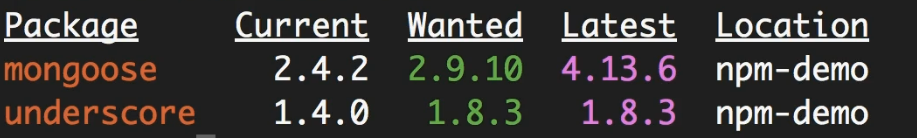

**Node Package Manager** (NPM) is a command-line tool as well as a registry(online database) of 3rd party libraries we can add to our applications.

We can see those packages on the npmjs website. We can install Node modules via a command-line tool also called npm (Node Package Manager).

Why NPM is considered as a CLI as well as registry ?

- The **tool you use locally** to manage packages (the CLI) (_npm install, npm update_)
- The **online service** that hosts the packages (the registry).

# Package.json

The **package.json** file is a basic file that contains information about the project. It is basically a bunch of metadata.

All Node.js applications have this package.json file. To create a package.json file, we can use the command `npm init`.

Also, if we want to create a package.json file without answering all the questions, we can use `npm init --yes`.

# Installing a Node Package

We can install a package using `npm install <package-name>`, and then it will be stored in a folder called **node_modules**.

When we add a Node package, it will automatically be added to the package.json file.

Every Node module has its own package.json file inside the node_modules folder.

# Using a package

When we want to use a package in Node.js, we include it using the `require` function.

This is how `require` resolves the required modules:

1. First, it checks whether the module is a core module in Node (like `os, path`).
2. Then it assumes it is a file or folder (if we add the `./`).
3. Then it assumes that it is a module in the `node_modules` folder.

# Package Dependencies

When we install the mongoose package, it also installs all its dependent packages. So, when we install a package, all its **dependency packages** are also installed in the **root node_modules** folder.

In earlier versions of Node.js, when we installed a package, its dependencies were stored inside that particular package's folder. But this created a mess because we ended up with the same package being installed in multiple places. In some situations, it also resulted in a very deeply nested structure.

So, in recent versions of Node.js and npm, all packages and their dependency packages are stored directly under the root node_modules folder.

There is an exception, however — if one of the packages depends on a _different version_ of a dependency than the one currently installed, then that version will be stored _locally inside that specific package’s folder_.

# Sematic Versoning

In Semantic Versioning, there are 3 numbers:

**4.11.3** — Major version, Minor version, Patch.

- **Patch** is used for bug fixes.

- **Minor version** is used to add new features that don’t break the existing API. (When we add a minor version, the patch resets to 0 because that version should have no bugs or instability — for example, next minor after 4.11.3 is 4.12.0.)

- **Major version** is incremented if a new feature is added that could potentially break or change the existing application behavior (e.g., next major version after 4.x.x would be 5.0.0).

Also, sometimes there is a character like `^4.11.3` (**caret**). This character tells npm that it is interested in **any version as long as the major version is 4**. So if there are new minor or patch versions available, npm will install those as well. (This is important because when someone gets the code from the repository after a few months, if there is a new version, that version will be downloaded and installed in the `node_modules` folder.)

Another way to represent the caret(`^4.13.6`) character is `4.x.x`; both mean the same thing.

There is also another character, the **tilde** ~. For example, `~4.11.3` means it is interested in any package where the **major version is 4 and minor version is 11**. An alternative way to write this is `4.11.x`.

These characters help the application keep its dependencies up to date with the latest releases.

However, sometimes this can cause issues. If in a later version someone finds a bug in a package and resolves it or adds a new feature, that change could affect our application.

So, in that case, we must ensure everyone is using the **same exact version**. Therefore, we should use the exact version in `package.json` without using tilde (~) or caret (^) characters.

# Listing the Installed Packages

So, based on semantic versioning, when we restore a project after getting it from a Git repository, it could install different versions of some packages — depending on how version ranges are defined in package.json.

There are a few ways to **check the installed package versions**:

1. By going to the `package.json` file inside the installed module's(package) folder in `node_modules`. (This file contains the exact version that was installed.)

2. Using the `npm list` command — this shows the **complete tree of all installed packages and their dependencies**.

3. Using `npm list --depth=0` — this s**hows only the packages directly installed in your project**, not their internal dependencies.

# Viewing Registry Info for a package

If we need to see important details about a package, we have a few ways:

1. Visit the npmjs website and see the details
2. `npm view mongoose` – see the full package.json file of the mongoose library
3. `npm view mongoose dependencies` – see all the dependencies of mongoose
4. `npm view mongoose versions` – see all the version releases by mongoose

# Install s Specific Version of a Package

npm install mongoose@2.4.2

# Updating Local Packages

Let's imagine currently our `mongoose` version is `^2.4.2` and `underscore` version is `^1.4.3`. As we build our application, there might be newer versions. If we need to find out what they are, we can check it by running:

```bash
npm outdated
```



Now, to update the packages, we can use:

```bash
npm update
```

(But here, it will only update _minor and patch_ versions. This is because in package.json, the versions have a caret (^), so it only accepts updates within the same major version.) So, underscore will be updated to the latest 1.8.3, but mongoose will be updated only to the latest version within major 2 (e.g., 2.9.10).

Note:

npm update will only update the package.json. To install the updated packages, we still need to run:

```bash
npm install
```

### Extra -:

If we want to update to the **latest versions** (**ignoring the version constraints** like caret ^ or tilde ~ in package.json), we should use a separate command-line tool called npm-check-update.

Install npm-check-updates globally (if not already installed):

```bash
npm install -g npm-check-updates
```

Check for the latest versions of all dependencies:

```bash
ncu
```

This will show you the dependencies and their latest versions, **regardless of the current** package.json **version range**.

Update your package.json with the latest versions:

```bash
ncu -u
```

Then install the latest packages:

```bash
npm install
```

# DevDependencies

In a Node.js project, there are two main types of dependencies listed in the package.json file:

### 1. Dependencies (dependencies)

These are the packages required for your application to run in production. They are essential for the core functionality of your app.

### 2. Development Dependencies (devDependencies)

These are the packages you need only during development, such as for testing, linting, or code analysis. They are not needed in production.

For example, if we want to install jshint (a tool to check for code quality) as a development dependency, we use:

```bash
npm install jshint --save-dev
```

# Uninstalling a Package

To uninstall a package, we can use one of the following commands:

```
npm uninstall mongoose
```

or

```
npm un mongoose
```

# Working with Global Packages

Normally, when we install a package, it is specific to a project. But there are some Node packages in the npm registry that are **not tied to a specific application**.

These are mostly command-line tools, such as:

- `npm` command-line tools
- `Angular CLI` (ng)
- `TypeScript`, `Vite`, `Webpack CLI`, etc.

If we want to install or work with a **global package**, we use the -g flag.

- `npm -g outdated` - Check for outdated global packages
- `npm list -g` - List all globally installed packages
- `npm install -g typescript` - install a global package

# Publishing a Package

We can publish a package using the command

```
npm publish
```

# Updating a Published Package

If we want to update a package, we need to:

1. Update the version number in the `package.json` file
2. Run the `npm publish` command again to publish the new version
