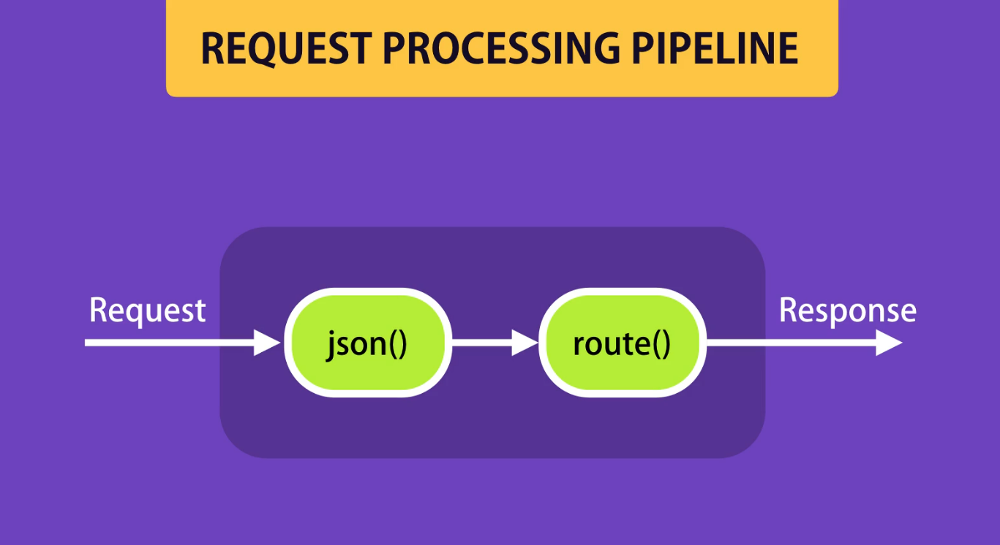

# Middlewear

One of the core concepts of Express is middleware or middleware functions. A middleware function is basically a function that takes a request object and either returns a response to the client or passes control to another middleware.

So far, our code has two middleware functions.

1. One is the route handler function (app.get('/', (req,res) => {}) Example). In Express, every route handler function is technically a middleware function because it takes a request object and sends a response to the client. So, it terminates the request-response cycle.

2. express.json() is also a middleware function. When we call the `express.json()` method, this method returns a middleware function. The job of this middleware function is to read the request and, if there is a JSON object in the body of the request, it will parse the body into a JSON object and then set the `req.body` property.

Essentially, this happens at runtime. When we receive a request on the server, that request goes through this pipeline. We call this pipeline a **request processing pipeline**. In this pipeline, we have one or more middleware functions. Each middleware function either terminates the request processing cycle by returning a response, or it will pass control to another middleware function.



So, Express includes a few middleware functions by default. But we can also create custom middleware that we can put at the front of our request processing pipeline. So every request that gets into our server will go through our middleware. With this custom middleware, we can perform cross-cutting concerns like logging, authentication, authorization, etc.

# Creating Custom Middleware

When we create a custom middleware, we should normally use `next()` to pass control to the next middleware. Otherwise, the request processing cycle will terminate.

# Built-in-Middleware

In Express, there are a few built-in middleware functions:

1. **express.json()** – This parses the body of the request. If there is a JSON object in the request body, it will populate the `req.body` property.

2. **express.urlencoded()** – This is a traditional method used to parse incoming requests with URL-encoded payloads (like HTML form submissions). It extracts key-value pairs from the request body and populates the `req.body` property, similar to how `express.json()` works for JSON data.

3. **express.static()** – This middleware is used to serve static assets like CSS files, images, JavaScript files, etc. You can use it to expose a folder (like `public`) that holds all your static files.

# Third-party Middleware

There are many third-party middleware packages available for Express. You can find a list of them in the Express documentation under (Resources → Middleware).

Here are a few popular ones:

1. **Morgan** – Logs incoming HTTP requests. Useful for debugging and monitoring.

2. **Helmet** – Helps secure your app by setting various HTTP headers to protect against common web vulnerabilities.

**Note** - Don't use unnecessary middleware, because it can slow down the request processing and affect your app's performance. Only include the middleware that is essential for your application's functionality.

# Environments

We should always know which environment we are working in — whether it's **development**, **production**, **testing** or **staging**. Based on the environment, we may want to enable or disable certain features (like logging, debugging, or error messages).

There are two main ways to check the environment:

1. `console.log(process.env.NODE_ENV)`

   This reads the environment variable `NODE_ENV` directly.

   - If the environment is not set, it will return `undefined`.

2. `console.log(app.get('env'))`

   This uses the Express `app.get('env')` method, which internally checks `process.env.NODE_ENV`.

   - If the environment is not set, this will default to `'development'`.

We can use this to conditionally enable or disable features depending on the environment.

To set the environment to production, you can run:

```bash
SET NODE_ENV=production   # On Windows
```

# Configurations

Normally, we need to manage configurations for each environment. For this, we can use Node packages (most popular are `rs` and `config`). Here, we will talk about `config`.

In a `config` folder, we can define the files for different environments, and then we can use them in our application.

**Note**: By default, even if NODE_ENV is not set (i.e., it is undefined), Express's app.env is automatically set to "development". Because of this, it will read the values from development.json configuration file.

But we **should not store secrets** in these config files. To handle that, we can set them using the terminal(`set express_demo_password1=1234`) and map them through a custom-environment-variables.json file.

If you want to set secrets for different environments using `custom-environment-variables.json`, you need to switch environments in the terminal and manually set the appropriate values for the same keys each time. For example, set a development password when in the development environment, and a production password when in the production environment, before starting your application each time you change.

## Alternative Ways

Instead of using the config package, we can also use the dotenv package for environment configuration and managing secret settings.

# Debugging

Sometimes, when we are debugging an application, we tend to use a lot of `console.log` statements. But later, we clear them out, and then again, we add them back. This is not a good practice.

Instead, we can use the `debug` third-party package.

So, we can divide the app into a few debug workspaces (because this debug package outputs based on function namespaces). For example: normal app debugging, database-related debugging — and we can associate each with a specific namespace.

Then, through environment variables or while running the app, we can set the debugging workspace we need:

```bash
set DEBUG=app:startup
# or
set DEBUG=app:db
# or
set DEBUG=app:startup,app:db
# or
set DEBUG=app:*

# or set Debug and run same time
DEBUG=app:* nodemon index.js # Only workd in Powershell and Bash
```

This is much easier than manually adding, finding, erasing, and re-adding `console.logs`.

# Template Engines

If we need to return some HTML markup in response to a request, we can use template engines.

Some of the most popular template engines are:

- Pug
- EJS
- Mustache

Each template engine has its own unique syntax.

# Database Integration

We can integrate multiple databases with an Express application.

To view all the supported options and guides, you can visit the Mongoose website and go to the "**Guide → Database Integration**" section.
