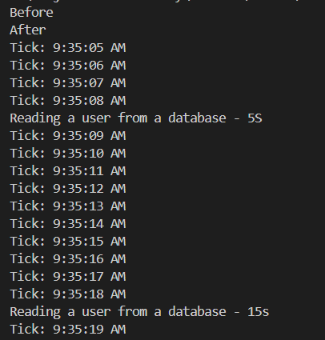

# Synchronous vs Asynchronous Code

```Javascript
console.log('Before');
console.log('After');
```

Above is Synchronous Code. Code is executed one after the other.In **SYNCHRONOUS**, the second line waits for the first line to finish before running.

```javascript
console.log("Before");
setTimeout(() => {
  console.log("Reading a user from a database - 5S");
}, 5000);
setTimeout(() => {
  console.log("Reading a user from a database - 15s");
}, 15000);
console.log("After");
```

First, it moves to the first line and executes `console.log("Before")`. Then it moves to the second line and **schedules** it to run **after 5 seconds** — it doesn't wait. Then it moves to the third line and **schedules** it to run **after 15 seconds** — again, it doesn't wait. Then it executes the `console.log("After")`.

Then, when 5 seconds are completed, the controller comes back and **executes the first timeout**. Then, after a total of 15 seconds (10 more from now), it **executes the second timeout**.

**Note**: **Asynchronous** never means _multi-threaded_ or _concurrent_. JavaScript has only a single thread (like the single waiter in our first restaurant example).



# Patterns for Dealing with Asynchronous Code

```javascript
console.log("Before");
const user = getUser(1);
console.log(user);
console.log("After");

function getUser(id) {
  setTimeout(() => {
    console.log("Reading a user from a database");
    return { id: id, gitHubUsername: "mosh" };
  }, 2000);
}
```

The output of above code is

```bash
Before
undefined
After
Reading a user from a database
```

- The reason we get `undefined` is because, at the time we are calling the `getUser` function, the **result is not yet available**.

- Inside the function, we are using a 2-second `setTimeout`, so the actual result (user object) will be available **after 2 seconds**.

- But JavaScript **does not wait**. The function finishes immediately and returns **nothing**, so `user` becomes `undefined`.

Now, if we try to fix it like this:

```javascript
console.log("Before");
const user = getUser(1);
console.log(user);
console.log("After");

function getUser(id) {
  setTimeout(() => {
    console.log("Reading a user from a database");
    return { id: id, gitHubUsername: "mosh" };
  }, 2000);
  return 1; // return a value immediately
}
```

Now it returns `1` immediately, so `console.log(user)` prints `1`.

```bash
Before
1
After
Reading a user from a database
```

However, this is **not the behavior we want**. We want the function to **wait** some time (like reading from a database or file), and **then return the result**.

To deal with this problem, we have 3 solutions

1. Callbacks
2. Proimniss
3. Async Await

These are ways to handle **asynchronous operations** properly in JavaScript, where you need to **wait for a result** before using it.

# Callback

Mosh - callback is a function that we are going to call when the results of asynchronous operation is ready.

ChatGPT - A callback is just a function you pass as an argument to another function — to be called later (usually after something finishes).

```javascript
console.log("Before");

getUser(1, function (user) {
  console.log("User:", user);
});

console.log("After");

function getUser(id, callback) {
  setTimeout(() => {
    console.log("Reading a user from a database");
    callback({ id: id, gitHubUsername: "mosh" });
  }, 2000);
}
```

Now the output is :

```bash
Before
After
Reading a user from a database
User : { id: 1, gitHubUsername: 'mosh' }
```

### Flow ->

Earlier in your code:

```javascript
getUser(1, function (user) {
  console.log("User:", user);
});
```

Here, you're calling `getUser` and passing a **function** as the second argument:

```javascript
function(user) {
  console.log("User:", user);
}
```

Above function becomes the `callback` parameter inside `getUser`.

#### So inside `getUser` :

```javascript
function getUser(id, callback) {
  setTimeout(() => {
    console.log("Reading a user from a database");

    // 👇 This line calls the function you passed in
    callback({ id: id, gitHubUsername: "mosh" });
  }, 2000);
}
```

This means:

- `callback` is really this function:

```javascript
function(user) {
  console.log("User:", user);
}
```

- When you write

```javascript
callback({ id: id, gitHubUsername: "mosh" });
```

- you are literally doing this:

```javascript
console.log("User:", { id: 1, gitHubUsername: "mosh" });
```

✅ **So in simpler terms**

`callback({ ... })` ➜ **calls** the function you passed in

And the value inside `{ ... }` becomes the **argument**

# Callback Hell

Here is an another example of using **callbacks**:

```javascript
console.log("Before");
getUser(1, function (user) {
  console.log("User :", user);

  //  Get the Repositories
  getRepositories(user.gitHubUsername, function (repos) {
    console.log("Repos : ", repos);
  });
});
console.log("After");

function getUser(id, callback) {
  setTimeout(() => {
    console.log("Reading a user from a database");
    callback({ id: id, gitHubUsername: "mosh" });
  }, 2000);
}

function getRepositories(username, callback) {
  setTimeout(() => {
    console.log("Reading Repositories from the API");
    callback({ username: username, repositories: ["repo1", "repo2", "repo3"] });
  }, 2000);
}
```

Explanation:

- We first get the **user** using `getUser`.
- Once we have the user, we call `getRepositories` using the user's GitHub username.
- Each function depends on the **result of the previous** one, so we nest them inside each other.

Now, imagine we have more steps. For example:

```javascript
// Asynchronous - Normal Function
console.log("Before");
getUser(1, function (user) {
  getRepositories(user.gitHubUsername, function (repos) {
    getCommits(repo.id, function (commits) {
      console.log("commits", commits);
    });
  });
});
console.log("After");

// Asynchronous - Arrow Function
console.log("Before");
getUser(1, (user) => {
  getRepositories(user.gitHubUsername, (repos) => {
    getCommits(repo[0], (commits) => {
      console.log("commits", commits);
    });
  });
});
console.log("After");

// Synchronous - For comparison — the synchronous version would look like:
console.log("Before");
const user = getUser(1);
const repos = getRepositories(user.gitHubUsername);
const commits = getCommits(repos[0]);
console.log("After");
```

So, Asynchronous callback code becomes deeply nested, and harder to read and maintain. This deeply nested structure is called Callback Hell. (It's hard to read, It's hard to manage, It gets worse with more steps)

# Named Functions to Rescue

Here, Instead of Arrow Functions and the function expression, We can use the Named Function to reduce the complexity a little bit.

```javascript
// Normal Code
console.log("Before");
getUser(1, function (user) {
  getRepositories(user.gitHubUsername, function (repos) {
    getcommits(repo[0], function (commits) {
      console.log("Commits", commits);
    });
  });
});
console.log("After");

function getUser(id, callback) {
  setTimeout(() => {
    console.log("Reading a user from a database");
    callback({ id: id, gitHubUsername: "mosh" });
  }, 2000);
}

function getRepositories(username, callback) {
  setTimeout(() => {
    console.log("Reading Repositories from the API");
    callback({ username: username, repositories: ["repo1", "repo2", "repo3"] });
  }, 2000);
}

function getcommits(repo, callback) {
  setTimeout(() => {
    console.log("Reading Commits from Repositories");
    callback({ repo: repo, commits: ["commit", "commit2", "commit3"] });
  }, 2000);
}
```

```javascript
// Named Function Code
console.log("Before");
getUser(1, getRepositories1);
console.log("After");

function getRepositories1(user) {
  getRepositories(user.gitHubUsername, getCommits1);
}

function getCommits1(repos) {
  getcommits(repo[0], displayCommits1);
}

function displayCommits1(commits) {
  console.log("Commits", commits);
}

function getUser(id, callback) {
  setTimeout(() => {
    console.log("Reading a user from a database");
    callback({ id: id, gitHubUsername: "mosh" });
  }, 2000);
}

function getRepositories(username, callback) {
  setTimeout(() => {
    console.log("Reading Repositories from the API");
    callback({ username: username, repositories: ["repo1", "repo2", "repo3"] });
  }, 2000);
}

function getcommits(repo, callback) {
  setTimeout(() => {
    console.log("Reading Commits from Repositories");
    callback({ repo: repo, commits: ["commit", "commit2", "commit3"] });
  }, 2000);
}
```

# Promises

A **Promise** is an object that represents the eventual result of an asynchronous operation. When the asynchronous operation completes, the promise will either return a **value** (if successful) or an **error** (if something goes wrong). In essence, a promise is a way to handle the result of an asynchronous task in the future.

A promise can be in one of **three states**:

1. Pending:

   This is the initial state when the promise is created. At this point, the asynchronous operation has started but hasn't completed yet.

2. Fulfilled (or Resolved):

   The asynchronous operation completed successfully, and the promise now holds a resulting value.

3. Rejected:

   The asynchronous operation failed, and the promise holds an error or reason for the failure.

```javascript
const p = new Promise(function (resolve, reject) {
  // Kick off some async work
  // ...

  setTimeout(() => {
    resolve({ id: 1, username: "mosh" });
    // reject(new Error('message'))
  }, 2000);
});

p.then((result) => {
  console.log(result);
}).catch((error) => {
  console.log(error.message);
});
```

# Replacing Callback with Promises

```javascript
// Before Code - Callback Code
console.log("Before");
getUser(1, function (user) {
  getRepositories(user.gitHubUsername, function (repos) {
    getcommits(repo[0], function (commits) {
      console.log("Commits", commits);
    });
  });
});
console.log("After");

function getUser(id, callback) {
  setTimeout(() => {
    console.log("Reading a user from a database");
    callback({ id: id, gitHubUsername: "mosh" });
  }, 2000);
}

function getRepositories(username, callback) {
  setTimeout(() => {
    console.log("Reading Repositories from the API");
    callback({ username: username, repositories: ["repo1", "repo2", "repo3"] });
  }, 2000);
}

function getcommits(repo, callback) {
  setTimeout(() => {
    console.log("Reading Commits from Repositories");
    callback({ repo: repo, commits: ["commit", "commit2", "commit3"] });
  }, 2000);
}
```

```javascript
// Replaced Callback with Promises
console.log("Before");
getUser(1, function (user) {
  getRepositories(user.gitHubUsername, function (repos) {
    getcommits(repo[0], function (commits) {
      console.log("Commits", commits);
    });
  });
});
console.log("After");

function getUser(id) {
  return new Promise((resolve, reject) => {
    setTimeout(() => {
      console.log("Reading a user from a database");
      resolve({ id: id, gitHubUsername: "mosh" });
    }, 2000);
  });
}

function getRepositories(username) {
  return new Promise((resolve, reject) => {
    setTimeout(() => {
      console.log("Reading Repositories from the API");
      resolve({
        username: username,
        repositories: ["repo1", "repo2", "repo3"],
      });
    }, 2000);
  });
}

function getcommits(repo) {
  return new Promise((resolve, reject) => {
    setTimeout(() => {
      console.log("Reading Commits from Repositories");
      resolve({ repo: repo, commits: ["commit", "commit2", "commit3"] });
    }, 2000);
  });
}
```

# Consuming Promises

```javascript
console.log("Before");
getUser(1)
  .then((user) => getRepositories(user.gitHubUsername)) // getUser returns a user object. If successful, call getRepositories
  .then((repos) => getcommits(repos[0])) // getRepositories returns a repositories object. If successful, call getCommits
  .then((commits) => console.log("Commits", commits)) // getCommits returns commits. If successful, log them
  .catch((error) => console.log("Error :", error.message)); // // If any of the above promises fail, catch the error and log the error message
console.log("After");

function getUser(id) {
  return new Promise((resolve, reject) => {
    setTimeout(() => {
      console.log("Reading a user from a database");
      resolve({ id: id, gitHubUsername: "mosh" });
    }, 2000);
  });
}

function getRepositories(username) {
  return new Promise((resolve, reject) => {
    setTimeout(() => {
      console.log("Reading Repositories from the API");
      resolve({
        username: username,
        repositories: ["repo1", "repo2", "repo3"],
      });
    }, 2000);
  });
}

function getcommits(repo) {
  return new Promise((resolve, reject) => {
    setTimeout(() => {
      console.log("Reading Commits from Repositories");
      resolve({ repo: repo, commits: ["commit", "commit2", "commit3"] });
    }, 2000);
  });
}
```

# Creating Settled Promises

Sometimes, we want to create a Promise that is already **resolved** or **rejected**. This is especially useful when writing **unit tests**, where we need to **simulate the outcome** of an asynchronous operation—such as calling a web server or fetching data from a database—without actually performing the operation.

By using `Promise.resolve()` or `Promise.reject()`, we can quickly create a promise that mimics a successful or failed asynchronous task.

You can see this approach used in the `promise-api.js`

# Parallel Promises

Sometimes, we want to run multiple asynchronous operations **in parallel**, and then perform an action **after all of them have completed successfully**. For example, calling the Facebook API and the Twitter API at the same time, and doing something once **both** responses are received.

To do this, we can use `Promise.all()`.

With `Promise.all()`, all the promises are run in parallel, and it waits until **all of them are resolved**. If **even one** of the promises is **rejected**, `Promise.all()` will **fail** and return an error.

```javascript
const p1 = new Promise((resolve, reject) => {
  setTimeout(() => {
    console.log("Asynchronous Operation 1...");
    resolve(1);
  }, 4000);
});

const p2 = new Promise((resolve, reject) => {
  setTimeout(() => {
    console.log("Asynchronous Operation 2...");
    resolve(2);
  }, 4000);
});

Promise.all([p1, p2])
  .then((result) => console.log("Result : ", result))
  .catch((error) => console.log(error.message));
```

Output is :

```bash
Asynchronous Operation 1...
Asynchronous Operation 2...
Result :  [ 1, 2 ]
```

If we want to do something **as soon as the first promise is resolved**, we can use `Promise.race()` (or `Promise.any()` depending on the use case).

- Promise.race() returns the result of the **first promise to settle**, whether it's **fulfilled or rejected**.

- Promise.any() returns the result of the **first promise that is fulfilled**, and **ignores rejections** unless all promises fail.

### Extra -> `Promise.any()` – What does "ignores rejections unless all promises fail" mean?

It means:

- If you pass multiple promises to `Promise.any()`, it will wait for **any one of them to be fulfilled (resolved)**.

- If one or more of them **reject**, it will simply **ignore** those and keep waiting for a successful (resolved) one.

- But if **all the promises reject**, then `Promise.any()` itself will also reject — with an `AggregateError` containing all the errors.
