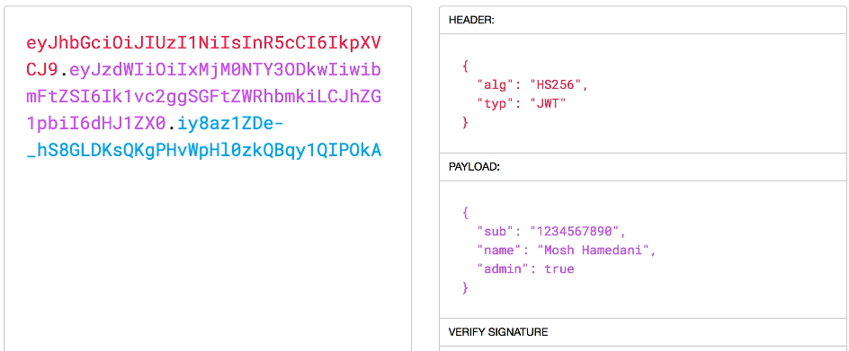

# Introduction

**Authentication** - The process of verifying the identity of a user to confirm they are who they claim to be

**Authorization** - The process of determining whether a user has the necessary permissions to perform a specific action

- Register: POST /api/users

- Login: POST /api/users - Sometimes, the operation we're dealing with doesn't follow the typical Create, Read, Update, Delete (CRUD) semantics. In RESTful terms, we model such operations as requests or commands — for example, a login request or login command.

  - **Command** - emphasizes the intent to perform an action.

  - **Request** - Refers to a custom operation that doesn't map to a standard REST resource.

# Registering User

findById(id) - Used to find a document by its \_id field only

findOne(filter) - Used to find a document matching any condition(s)

# Using Loash

When returning data, we **should not return the password**. We can simply return the object without the password, and that is okay.

```javascript
res.send({
    _id:result._id
    name:result.name,
    email:result.email
});

```

But to do this more efficiently, we can use an external library called **`Lodash`**.

Lodash provides a lot of utility functions to work with objects, numbers, arrays, and strings. It is an optimized version of the **`Underscore`** package.

Also, if we want to enforce password complexity (like requiring lowercase, uppercase letters, numbers, etc.), we can use the npm package **`joi-password-complexity`**, which is built on top of Joi.

# Hashing Passwords

To hash passwords, we can use the popular library called bcrypt.

To hash a password, we need a salt. Salt means a random string that we add to the beginning or end of the password.
For example, if the password is 1234 and the hash result is abcd, a hacker could try many passwords and compare hashes to guess the password. But when we use salt, the resulting hashed password is different each time because of the salt used.

So, the hashed password includes the salt, either at the beginning or after.

```txt
Password: 123456
Salt: $2b$10$5wW6VYH1aZZe8j3qGFkdSe
Hashed password: $2b$10$5wW6VYH1aZZe8j3qGFkdSeidy5l.lFjvCilXWCzlR9U4x7.uMe16q

# Breaking down the hashed password:

$2b$ — version
10$ — cost factor (salt rounds)
5wW6VYH1aZZe8j3qGFkdSe — salt
idy5l.lFjvCilXWCzlR9U4x7.uMe16q — hashed password
```

The reason the salt is included in the hash is: when we authenticate the user, we want to validate the username and password. So when the user sends their password in plain text, we need to hash it again — but we need the original salt that was used to generate the stored hash.

During comparison of the plain text password with the hashed password, bcrypt extracts the original salt from the hash automatically to perform the validation correctly.

# Authenticating Users

**Note** - When Validating Passwords, We use `bcrypt.compare` method. In there, Bcrypt doesn't decrypt the stored password. Instead, it extracts the salt from the stored hash, re-hashes the plain text password using that salt, and compares the result with the stored hash to validate the user.

# JSON Web Token

JSON Web Token is a long string that identifies a user. (As a metaphor, we can think of it as our driver's license.)

When the user logs in, the server generates the JSON Web Token. We give it to the client. And then, every time the client reaches the API endpoints, they should show their JWT token (_driver's license_) to validate.

JWT tokens have 3 parts: **Header, Payload**, and **Digital Signature**.

In JWT, payloads include the public properties (data) about the user.



#### Real World Scenario

**Q** -

Is the above scenario secure? Anyone can set themselves as admin and they will be treated as admins?

**A**

But that is not how JWT works. The **third par**t of JWT (digital signature) is created based on the content of the JSON Web Token along with a secret or private key. This **secret or private key** is stored on the server.

So, if a malicious user gets the JWT and modifies the `admin` field to `true`, then the digital signature will be **invalid**, because the content of the JWT was modified. Now they would need a new digital signature. **But the hacker can't generate the new digital signature** because they don’t have access to the private key on the server.

So, when they send the new **tampered JWT**, the server will decline that.

# Storing Secrets in Environment Variables

There are two main methods to store secrets in an application:

#### 1. Using dotenv:

Secrets are stored in a .env file, which is loaded into environment variables when the app starts.

#### 2. Using configuration files:

When using config files, there are two approaches:

- Storing secret values directly inside the config file.

- Setting secret values through environment variables, which can be done either by:

  - Manually setting them in the terminal before running the app (need to set these environment variables manually every time before running the app, which can be repetitive and inconvenient),

  - Loading them from another .env file.

Using dotenv is easy and convenient for **managing secrets locally**. However, configuration files help organize and manage settings **more effectively across different environments** (such as development, testing, and production).

**Note:** Once you call `require("dotenv").config()`; in your main entry file (e.g., index.js), all environment variables from the .env file are loaded into process.env, and you can access them from any other file in the project.
