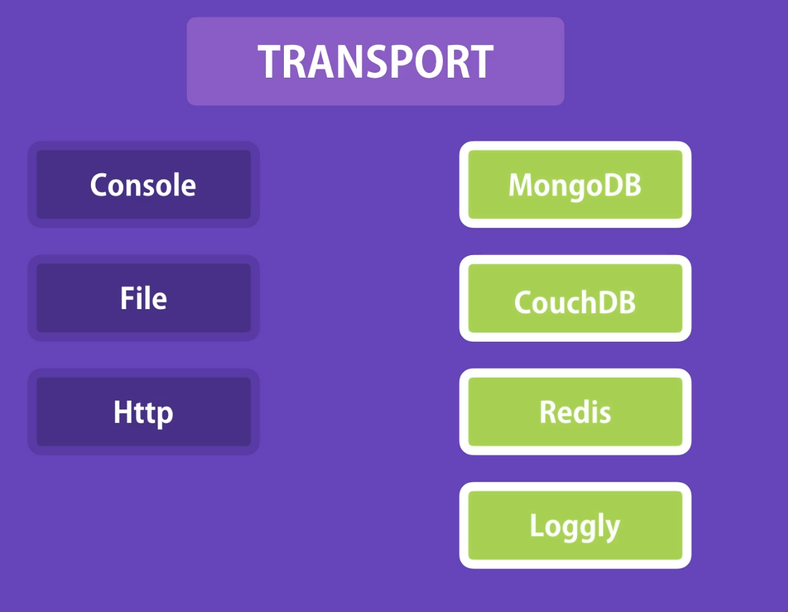

# Handling Rejected Promises

When using promises, it's important to always handle rejections.

- If you're using regular `.then()` syntax, make sure to include a `.catch()` block.

- If you're using `async/await`, you should wrap the code in a `try...catch` block to handle any potential errors.

Example – **UnhandledPromiseRejectionWarning** -: This warning means you used a promise but didn’t handle its rejection properly. You likely forgot to use `.catch()` (or a `try...catch` block if using async/await). If promise rejections are not handled, they can eventually crash your application.

Note - In this commit I forgot to add the next to generes API, We should add it.

# Express Error Middleware

In typical error handling, we send an error message directly in each route. However, this approach can lead to repetitive code. A better solution is to move the error-handling logic into a separate middleware function.

By doing this, if we ever need to change how errors are handled, we only need to update the logic in one place.

In Express, error-handling middleware should be registered **after all other middleware and route handlers**.

# Remove Try Catch Block

Even though we use middleware in Express, we still have to write `try/catch` blocks in every route handler to handle asynchronous errors. This becomes repetitive and distracts us from focusing on the actual business logic.

To solve this, we can create a reusable `try/catch` wrapper (like a template) and use it for all route handlers. This way, we can keep our code clean and focus on writing the core logic without repeating error-handling code.

# Express Async Errors

When we remove `try-catch` blocks, we can use an custom function (`asyncMiddleware` function ) as a try-catch wrapper. This is a valid approach.

But there's another easier solution. There is a package called `express-async-errors`, so we don't need to worry about writing an async middleware function. Our async route handlers will automatically be wrapped, and any errors thrown will be caught at runtime and passed to Express's error-handling middleware. So, we don’t need to explicitly use an async middleware function.

So, to remove `try-catch` blocks, there are two approaches:

1. Using a custom function (`asyncMiddleware` function)

2. Using the `express-async-errors` 3rd-party package

# Loggin Errors

In every application, we should log the message. To do that, we can use the Winston library.

const `winston = require("winston");` - This is the default logger that is exported from Winston. BUT if needed, we can create custom loggers manually (in the example we create a custom logger, but we can also use the default logger without creating a new logger). [Here logger means how it prints the data.]

This logger object has transports. A transport is essentially a storage device for our logs. So Winston comes with a few pre-built transports like console (for logging messages on the console), file, HTTP (for calling HTTP endpoint for logging messages). There are also plugins for Winston for other npm packages for logging messages to places like MongoDB, CouchDB, Redis, Loggly (a very popular log analytics and monitoring service).

---

This logger object has transports. A **transport** is essentially a storage device for our logs. So Winston comes with a few pre-built transports like console (for logging messages on the console), file, HTTP (for calling HTTP endpoint for logging messages). There are also plugins for Winston for other npm packages for logging messages to places like MongoDB, CouchDB, Redis, Loggly (a very popular log analytics and monitoring service).

---

When logging error messages, we should set the logging levels. Logging level determines the importance of the messages we log:

- error – For serious issues that cause failures or crashes
- warn – For potential problems or important warnings
- info – For general operational messages about application progress
- verbose – For detailed messages, more than info but less than debug
- debug – For debugging messages to diagnose issues
- silly – For very detailed and fine-grained messages, usually noisy

Winston follows this log level priority (highest to lowest):

error → warn → info → http → verbose → debug → silly

When setting transports, we can set the logging error level too. If we set the level to info, it will log info, warn, and error — all higher or equal levels.
