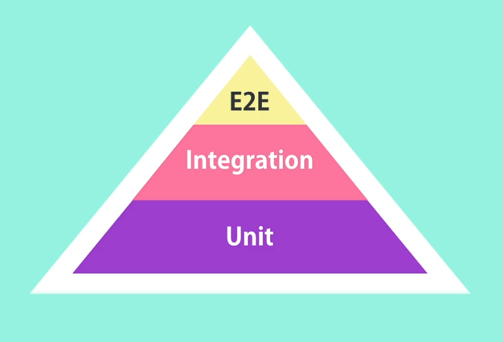
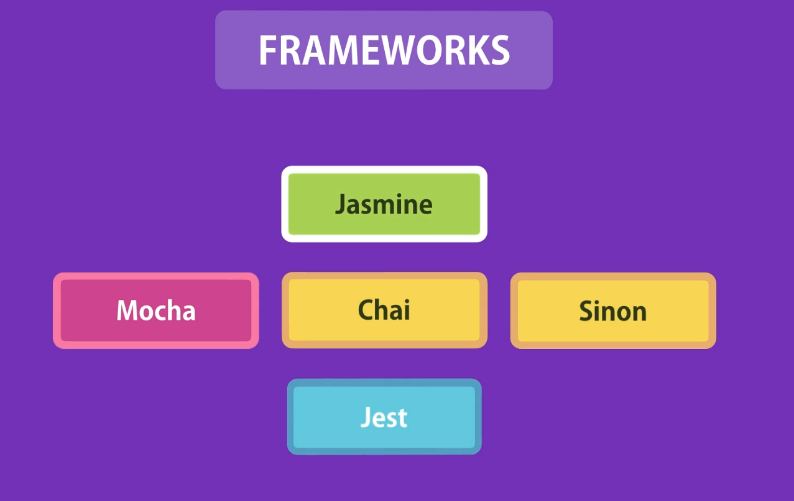

# What is Automated Testing ?

**Automated testing** is the practice of writing code that tests your application code, and then running those tests automatically.

In an automated testing setup, your source codebase consists of two parts:

- **Production code** – the actual application logic
- **Test code** – the code that verifies the production code works correctly

Automated tests can be run:

- Every time you change the code
- Every time you commit your code
- Before deploying the application

Because these tests are automated and repeatable, they help catch bugs quickly and consistently.

With automated testing, it's possible to test all the execution paths of your application in less than a second, making development faster and more reliable.

# Benifits of Automated Testing

- Testing your code frequently, in less time

- Catch bugs before deploying

- Deploy with confidence

- Refactor with confidence - **Refactoring** means changing the structure of the code without changing it's behaviour

- Focus more on the quality

# Types of Tests

### Unit Test

Test a unit of an application **without its external dependencies** such as files, databases, message queues, web services, and so on.

Unit tests are cheap to write and execute fast. They can make sure each building block of the application is working as expected.

However, since we don’t test classes or components with their external dependencies, we can't get a lot of confidence in the overall reliability of the application.

### Intergration

Test a class or component **with** its external dependencies.

These tests take longer to execute but give more confidence in the system.

Traditionally, an integration test is defined as a test that combines a few units or classes and tests their behavior as a whole. So, based on this definition, if we test two classes together—even if none of the classes talk to external dependencies like a database—some people may call it an integration test and not a unit test.

But this definition is a **great recipe for writing fragile (easily breakable) tests** that are tightly coupled to your implementation details.

So as you change the implementation of your classes, these tests may break—and you'll end up wasting your time.

In summary:

- A **unit test** tests one or more classes **without** their external dependencies. It tests a “unit of work.”
- An **integration test** tests one or more classes or components with their dependencies.

## End-to-End Test

These tests drive an application through the **user interface**.

There are specific tools to build end-to-end tests.

One popular tool is **Selenium**, which allows you to record the interaction of a user with your application, play it back, and check whether your application gives the right results or not.

These tests give you the **greatest amount of confidence** about the health of your application.

But the problems are:

- They are **very slow** (each test needs to launch the application and interact through the UI)

- They are **very brittle** – meaning even a small change in the UI can break the tests.

# Test Pyramids



According to this pyramid, most tests should be **unit tests.** – Great for quickly testing the logic such as conditional logic and loops. If we have **complex logic and calculations, we should test them with unit tests**.

We should have a bunch of **integration tests**. If our app has more external dependencies than complex logic, we have to write more integration tests.

Very few **end-to-end tests** for the key functions. We don’t test edge cases with E2E tests. We **only test the happy path with the E2E test**. We test edge cases with unit tests.

Note – This pyramid is only a guideline. The actual ratio between unit, integration, and end-to-end tests depends on your project.

# Tooling

To write tests, we need a test framework. A test framework includes a library that has utility functions to write tests. It also provides a test runner which runs tests and gives a report to us showing how many tests passed and failed.



Jest is built on top of Jasmine. Jest has all the features in Jasmine, as well as a built-in code coverage tool.

Always install testing libraries as development dependencies

# Testing Numbers

### A general Question

**`Q`** – How many unit tests should we write for a function?

Basic guideline is: The number of unit tests for a given function should be greater than or equal to the number of execution paths (return paths).

### Matcher Function

To make assertions on values, we use **matcher functions** (e.g., `toBe`, `toEqual`, `toBeNull`).

# Testing Numbers

When testing strings, we should make sure the test is not too specific or too general. (If we write a test case to check for an exact pattern in the string, and tomorrow we change the display text by adding or removing a word (even a dot), the test case will break — even if the functionality is still correct.)

Note - `it()` and `test()` are functionally the same in Jest

# Testing Arrays

#### Example for too general and too specific test cases

```javascript
describe("getCurrencies", () => {
  it("should return supported currencies", () => {
    const result = lib.getCurrencies();

    // Too general
    expect(result).toBeDefined();
    expect(result).not.toBeNull();

    // Too specific
    expect(result[0]).toBe("USD");
    expect(result[1]).toBe("AUR");
    expect(result[2]).toBe("EUR");
    expect(result.length).toBe(3);

    // Proper Way - Check for existance without checking the location
    expect(result).toContain("USD");
    expect(result).toContain("AUR");
    expect(result).toContain("EUR");

    // Ideal Way
    expect(result).toEqual(expect.arrayContaining(["EUR", "USD", "AUD"]));
  });
});
```

# Testing Objects

When testing objects, we should **not use** `toBe`, because it checks the **same reference** of the objects.

**Instead**, we can use `toEqual`, `toMatchObject`, and `toHaveProperty`. But when we use `toEqual`, our test becomes **too specific**, so it's better to use `toMatchObject` or `toHaveProperty`.

```javascript
describe("getProduct", () => {
  it("Should return the product with the given id", () => {
    const result = lib.getProduct(1);

    expect(result).toEqual({ id: 1, price: 10 }); // received object should have only these two properties exactly
    expect(result).toMatchObject({ id: 1, price: 10 }); // received object should at least contain these two properties
    expect(result).toHaveProperty("id", 1); // received object should at least have this property
  });
});
```
